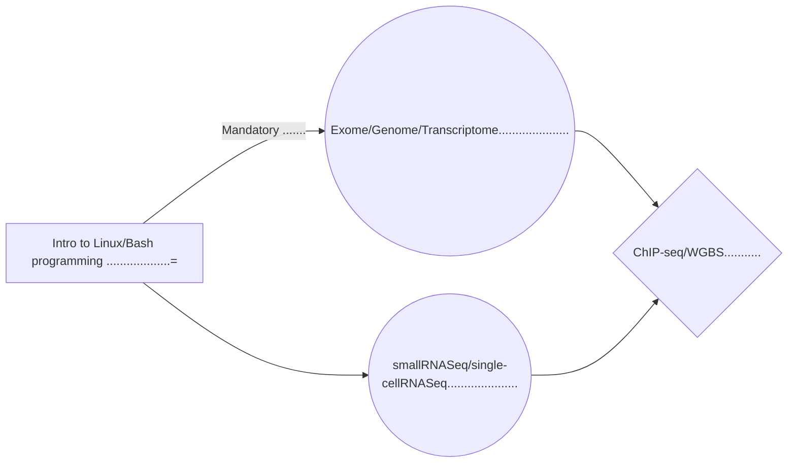

# Welcome to LabTk!

Hi! This repository is used to introduce students with High Performance Computing (HPC), Next Generation Sequence (NGS) file formats, NGS data analysis (DNASeq, RNASeq, microRNA, ChIPSeq, WGBS...), data visualization, and interpretation..

It is assumed that, if you are reading this, you already received your Compute Canada (CC) account, otherwise, follow these  [Instructions!](https://docs.computecanada.ca/wiki/Compute_Canada_Documentation)

## Logging to your regional CC cloud

All along this repository, we will assume that you will be using **Graham** cluster. Note that you can do the same to any of the CC clusters, be it **Cedar**, **Beluga** ...

    ssh <your_username>@graham.computecanada.ca
    ssh <your_username>@graham.sharcnet.ca

## Setting your environment

Your supervisor was assigned a 7-digit **Project Number** on **Graham**, make sur that you know this number.
You will need it to set your working environment and know your lap (and PI) project space.
If Dr.Tetreault Project Number is **6019267**, the project space will be:

    /project/6019267/

 You should see your own folder (where you can store intermediate results) inside the project space appearing as:

    /project/6019267/<your_username>

Note that once you finish your analyses, the final results should be pushed into the lab shared folder, named:

    /project/6019267/lab/projects/<new_project_name>

### Let's now configure your environment.
There are a lot of bioinformatics tools and yo will not need to set up any. You will just need to pre-load the appropriate location in your **~/.bash_profile**. Copy and paste the code below in your ~/.bash_profile and do not try to change any code if you do not understand its meaning. We will cover later in the lab, all the code meanings.

  

    if [ -f ~/.bashrc ]; then
    	. ~/.bashrc
    fi

    export PATH="/project/6019267/singularity/1.1.0/images/bin:$PATH"
    
      
#
# Proposed learning path

#
# What is covered here ?

## Introductory Hands-ons

 - [ ] Introduction to Linux and Bash Programming 
 > [A quick look at Unix/Linux commands]()
 > [First steps in Bash programming]()

## Preparing analyses

 - [ ] Pre-processing step (QC, DESIGN and YAML files)
 > [Pre-alignment QC]().
 > [Preparing your DESIGN file]()
 > [Build your YAML config file]().
#
## Exome/Genome analyses

 - [ ] DNASeq processing (**erm** workflows)
 > [ SNV calling workflow]().
 > [Structural variant workflow]().
 > [HLA-typing workflow]().
 - [ ] DNASeq post-processing (QC Review, Differential Expression, Alternative Splicing, PolyAdenylation analysis)
> [Post-erm QC Review]().
> [Functionally annotating variants]().
> [Prioritizing variants]().
#
## Transcriptomic analyses

 - [ ] RNASeq processing (**erm** workflows)
 > [ mRNA workflow]().
 > [microRNA workflow]().
 > [single cell RNA workflow]().
 - [ ] mRNA post-processing (QC Review, Differential Expression, Alternative Splicing, PolyAdenylation analysis)
> [Post-erm QC Review]().
> [Differential Expression Analysis]().
> [Alternative Splicing Analysis]().

#
## Epigenetic analyses
 - [ ] ChIPSeq/WGBS processing (**epi** workflows)
 > [ ChIPSeq workflow]().
 > [WGBS workflow]().
 - [ ] ChIPSeq/WGBS post-processing (QC Review, Peakness Analysis, Differential and Partial Methylation analyses)
> TODO

